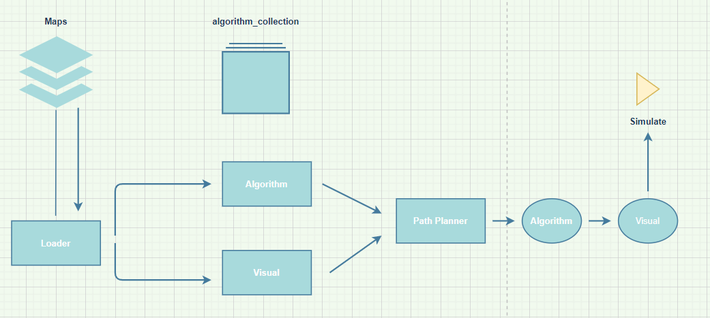

# path_planner
Path planning framework which allows the uploading or creation of "map" files,  
which can be algorithmically planed and simulated.

## Table of contents
* [Requirements](#Requirements)
* [Installation](#Installation)
* [Features](#Features)
* [Documentation](#Documentation)

## Requirements
- Works on Linux, Windows
- anaconda

## Installation 
- need to install mpl_toolkits.basemap import Basemap
    * https://matplotlib.org/basemap/users/installing.html
- install matplotlib.pyplot as plt

## Features

## Documenation

